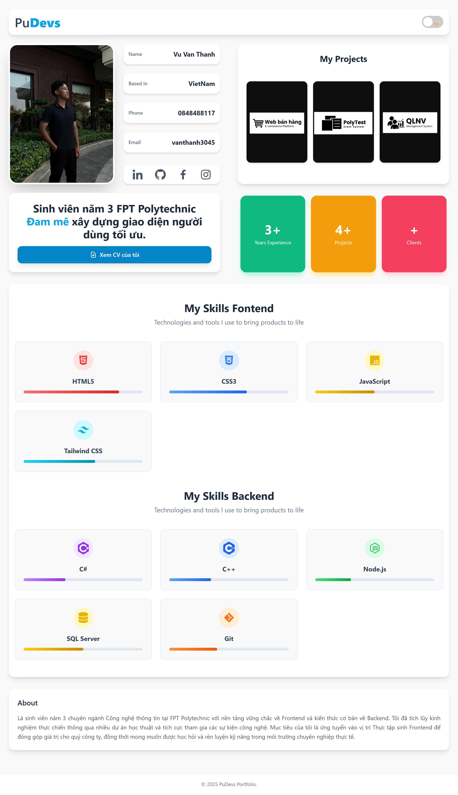

# 🌐 Portfolio Cá Nhân - [PuDevs]

> Chào mừng đến với trang Portfolio của tôi! Đây là nơi tôi lưu trữ các dự án, kỹ năng và thông tin cá nhân.

*(Thay đường link ảnh trên bằng ảnh chụp trang web của bạn)*

## 🌟 Giới thiệu
Dự án này được xây dựng để giới thiệu bản thân, show các dự án đã làm và kết nối với nhà tuyển dụng. Giao diện được thiết kế theo phong cách hiện đại, tối giản và Responsive (tương thích mọi thiết bị).

- **Demo trực tiếp:** [https://dev.pudevs.online/]
- **Tác giả:** [PuDevs]

## 🚀 Công nghệ sử dụng (Tech Stack)
Dự án được xây dựng hoàn toàn thủ công (No Framework) để rèn luyện kỹ năng cốt lõi:

*  **HTML5**: Xây dựng cấu trúc trang.
*  **CSS3**: Định dạng, Flexbox, Grid, Animation.
*  **JavaScript**: Xử lý logic, hiệu ứng tương tác.

